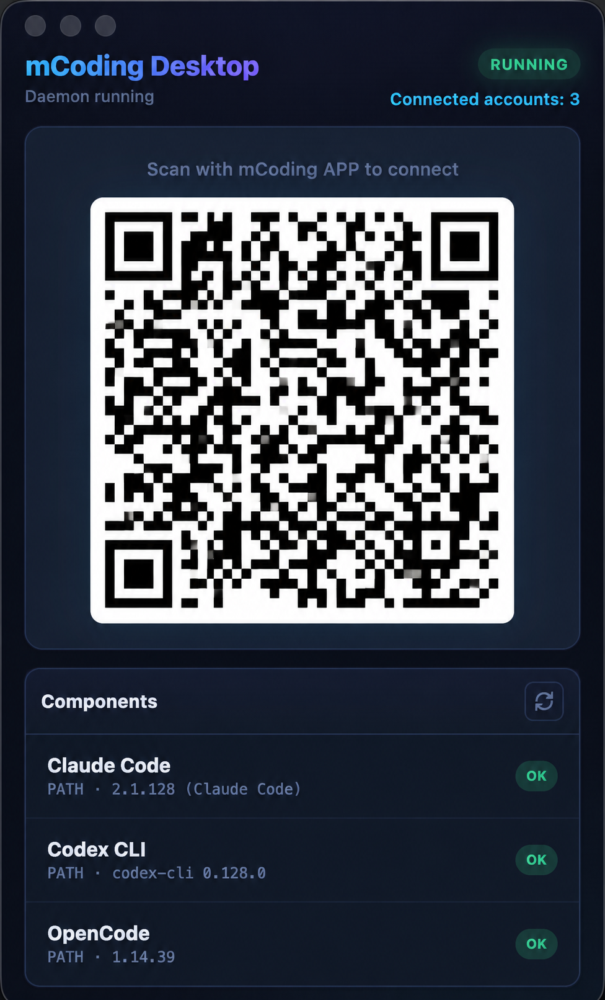
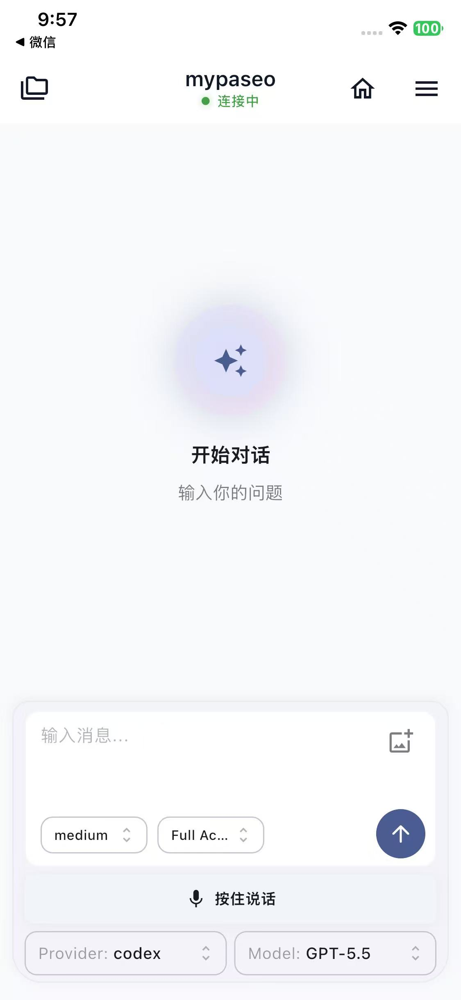

# mcoding:个人电脑远程 AI 编程工具

这是一个开源的自托管远程 AI 编程app。支持 Claude Code、Codex CLI、OpenCode 。

该项目抽离了 Paseo 的 daemon、relay 核心模块，剪裁其它功能，方便国内用户使用：

- `flutterpaseo/`：Flutter 移动端，用于扫码配对、管理已连接主机、选择项目目录、创建远程 AI 编程会话和收发对话。
- `relay-service/`：NestJS 后端中继服务，负责自托管  WebSocket 转发、健康检查和连接统计。
- `electronDesktop/`：Electron 桌面端，用于启动和管理本机 daemon、配置自托管 relay 地址、展示配对二维码、查看 daemon 状态和管理本地 AI CLI 工具。

## 使用方法

1. 运行/部署 relay-service 的中继服务。默认端口 8787

    ``npm run dev``

2. 电脑端运行 desktop，手动输入 relay-service 地址，*例如 `192.168.x.x:8787`，生成二维码

3. 安装 app，直接扫码连接，开始远程编程。

4. 如果需要使用语音，在 app 的设置中配置阿里云 ASR 秘钥即可

如果你嫌麻烦，可以直接使用mcoding 商业版，无需部署，免费使用，可直接使用语音
支持iOS，Android，鸿蒙即将上线
https://mcoding.huatongai.cn/
